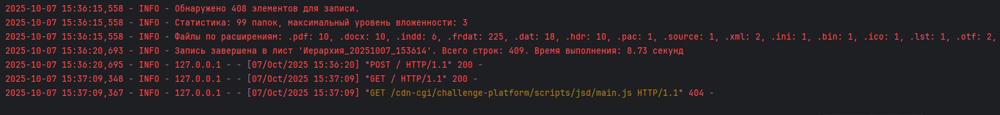

# Document Folder Processor

Это Flask-приложение для анализа структуры директорий с документами (PDF, DOCX, XLSX, архивы RAR/ZIP). Оно подсчитывает страницы в PDF, определяет ориентацию (альбомный/книжный), игнорирует .db файлы, сортирует натурально (с поддержкой кириллицы) и записывает иерархию в Google Sheets или временный JSON-файл.

Проект создан с помощью Grok (xAI) для помощи в разработке, но код написан и отлажен мной.

## Функции
- Получение структуры папки (рекурсивно).
- Анализ PDF: количество страниц, ориентация (альбомный/книжный).
- Поддержка архивов (RAR/ZIP, но без извлечения).
- Запись в Google Sheets с цветовым форматированием уровней.
- Логирование и обработка ошибок.
- Поддержка разных платформ (Windows/WSL).

## Установка
1. Клонируйте репозиторий: `git clone https://github.com/2ti4/directory-hierarchy.git`
2. Создайте виртуальное окружение: `python -m venv venv`
3. Активируйте: `venv\Scripts\activate` (Windows) или `source venv/bin/activate` (Linux/Mac)
4. Установите зависимости: `pip install -r requirements.txt`
5. Получите Google Service Account JSON: Создайте в Google Cloud Console, поместите как `credentials/service-account.json`.
6. Запустите: `python app.py`
7. Откройте: `http://localhost:5002`

## Использование
- Введите путь к папке (например, `D:\Orders\123`).
- Опционально: укажите URL или название Google Sheets для записи результатов.
- Результат: иерархия сохраняется во временный JSON-файл, а при указании Google Sheets — в таблицу с цветовым форматированием.

## Скриншоты
  
*Страница для ввода пути к папке и Google Sheets.*

  
*Иерархия в Google Sheets с цветовым форматированием.*

  
*Пример логов обработки.*

## Технологии
- Python 3.12+
- Flask для веб-интерфейса.
- pdfplumber для анализа PDF.
- gspread для Google Sheets.
- natsort для натуральной сортировки.
- Логирование с logging.

## Лицензия
MIT License (см. LICENSE).

## Контакты
Для вопросов: https://t.me/Pichi_ILYA